# Projet de Gestion de Consultation

Ce projet de gestion de consultation utilise **Thymeleaf, Spring Boot, Bootstrap, HTML & CSS**.

## 📌 Fonctionnalités du modèle Patients

### 📋 Liste des Patients

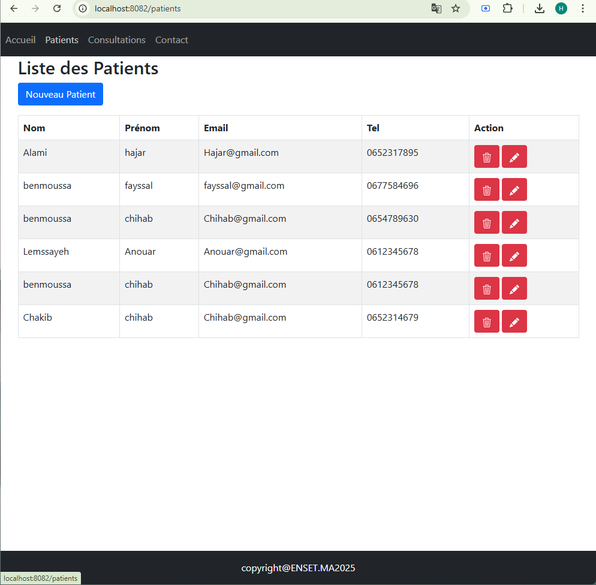
La "Liste des Patients" est une interface simple et organisée qui affiche les informations des patients dans un tableau. Elle inclut le nom, prénom, email et numéro de téléphone, facilitant la gestion des données des patients dans un contexte médical.

### ➕ Création d'un nouveau Patient
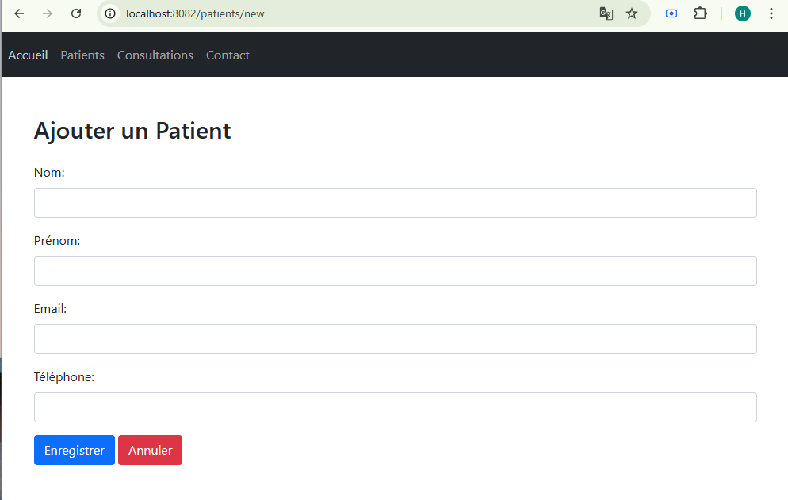
Le formulaire "Ajouter un Patient" permet de saisir les informations d'un nouveau patient, incluant le nom, prénom, email et numéro de téléphone. Il propose des boutons pour enregistrer ou annuler l'ajout, facilitant la gestion des données des patients.
### ✏️ Modification d'un Patient
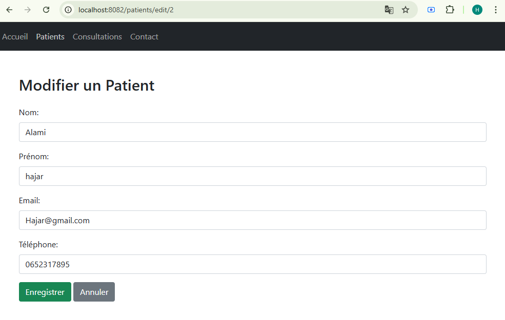
Le formulaire "Modifier un Patient" permet de mettre à jour les informations d'un patient existant, telles que le nom, prénom, email et numéro de téléphone. Il offre une interface simple pour effectuer des modifications et maintenir les données à jour.
### 🗑️ Suppression d'un Patient
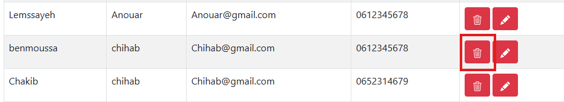
Le bouton "Supprimer un Patient" permet de retirer définitivement les informations d'un patient existant, telles que le nom, prénom, email et numéro de téléphone. Il offre une solution rapide pour supprimer un enregistrement et maintenir une base de données propre et à jour.
## 📌 Fonctionnalités du modèle Consultations

### 📋 Liste des Consultations
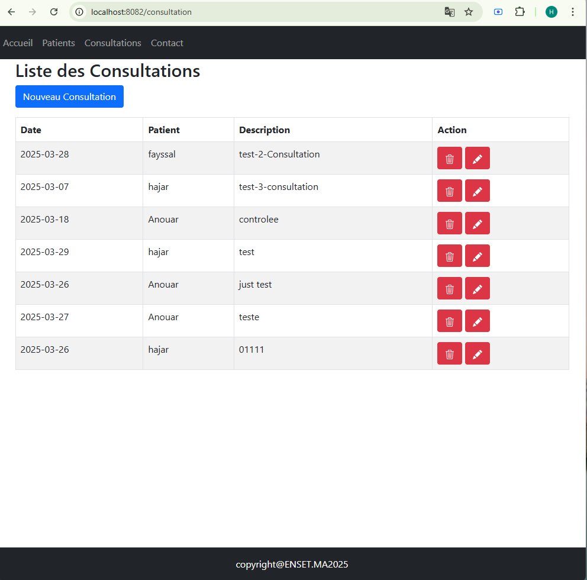
La "Liste des Consultations" est une interface qui affiche les rendez-vous planifiés dans un tableau organisé. Elle inclut des colonnes pour la date, le patient concerné, la description de la consultation, et une colonne d'action pour gérer chaque entrée. Cette interface facilite la visualisation et la gestion des consultations, permettant aux professionnels de santé de suivre et organiser efficacement les rendez-vous.
### ➕ Création d'un nouveau Consultation
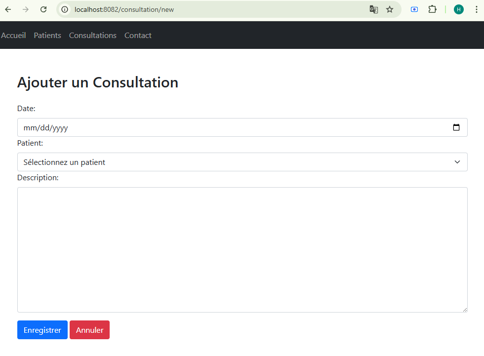
Le formulaire "Ajouter une Consultation" permet de planifier un nouveau rendez-vous en saisissant la date, en sélectionnant un patient et en ajoutant une description de la consultation. Il propose des boutons pour enregistrer ou annuler l'ajout, facilitant la gestion des rendez-vous dans un contexte médical.
### ✏️ Modification d'un Consultation
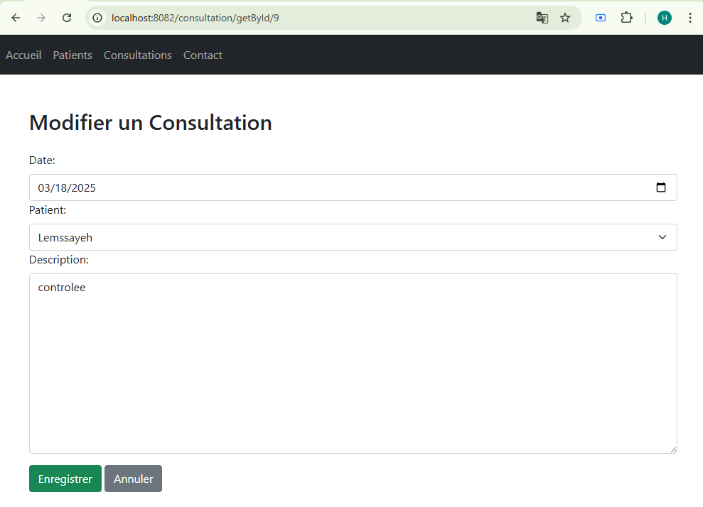
Le formulaire "Modifier une Consultation" permet de mettre à jour les informations d'une consultation existante, telles que la date, le patient et la description. Il offre une interface simple pour effectuer des modifications et maintenir les rendez-vous à jour. Le bouton "Supprimer" permet d'annuler définitivement la consultation, simplifiant la gestion des rendez-vous.
### 🗑️ Suppression d'un Consultation
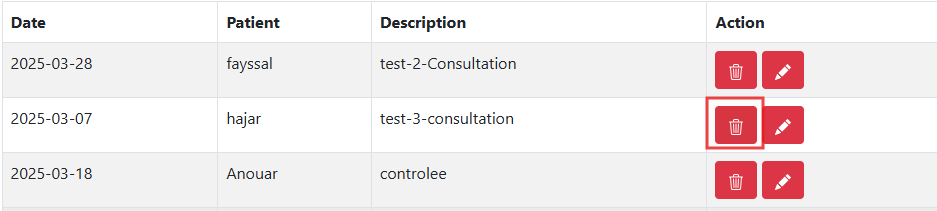
Le bouton "Supprimer une Consultation" permet de retirer définitivement une consultation existante de la liste, y compris la date, le nom du patient et la description. Cela facilite la gestion des consultations et maintient les données à jour.
## 📌 Fonctionnalités du modèle Contact

### 📞 Page Contact
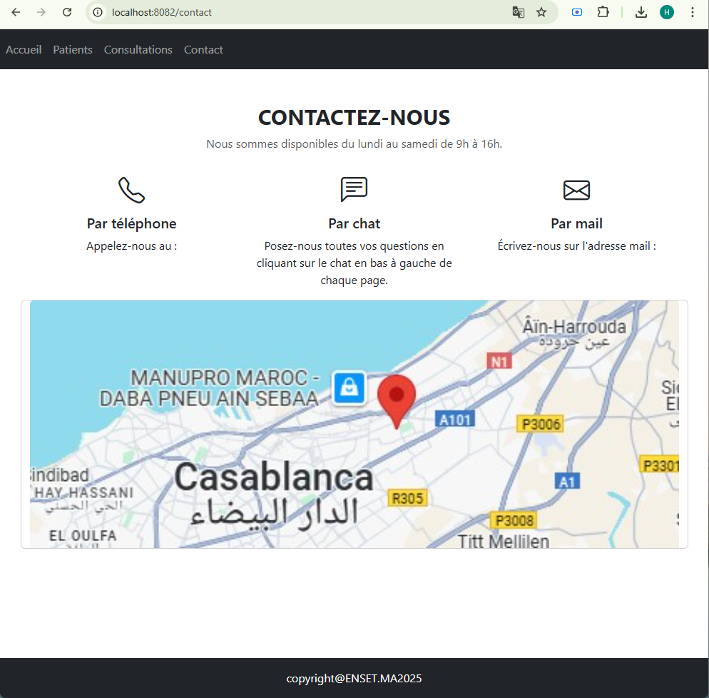
La page Contactez-nous offre plusieurs moyens de communication aux utilisateurs souhaitant obtenir des informations ou de l’aide :

📱 Par téléphone
Contactez-nous directement par appel. Le numéro s’affiche ici.

💬 Par chat
Posez toutes vos questions via le module de discussion disponible en bas à gauche de chaque page.

📧 Par mail
Écrivez-nous à notre adresse mail pour toute demande d'information ou prise de rendez-vous.

🕐 Disponibilité : du lundi au samedi, de 9h à 16h.

📍 Une carte interactive affiche notre localisation à Aïn Sebaâ – Casablanca, pour faciliter l’accès au cabinet.
## 📌 Fonctionnalités du modèle Accueil
### 🏠 Page d'Accueil
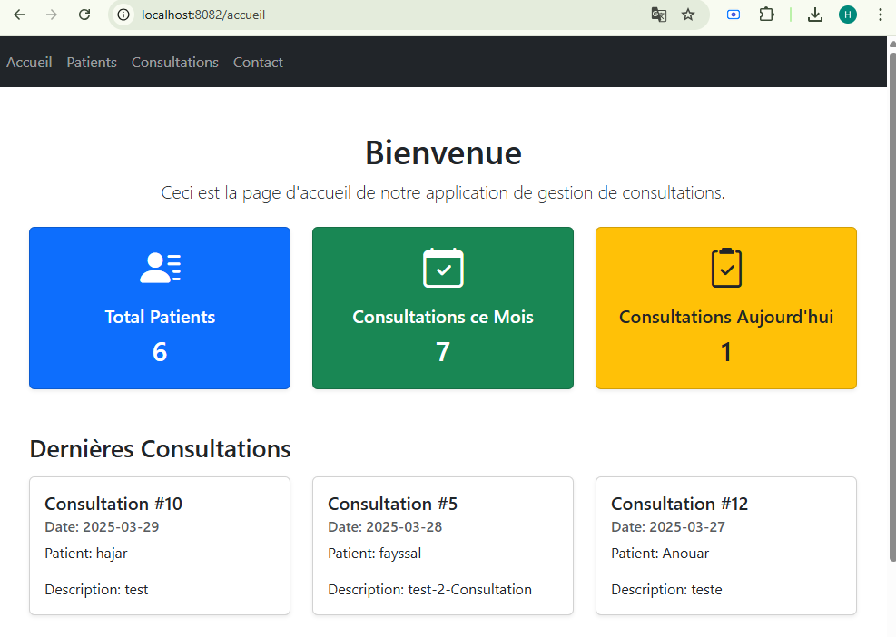

La page d’accueil de l’application fournit une vue d’ensemble des principales statistiques et des dernières consultations enregistrées.

✅ Statistiques globales

🔵 Total Patients : Affiche le nombre total de patients enregistrés dans le système .

🟢 Consultations ce Mois : Indique le nombre de consultations planifiées ou effectuées au cours du mois en cours .

🟡 Consultations Aujourd’hui : Montre les consultations prévues pour la journée actuelle .

🗂️ Dernières Consultations :
Cette section permet un suivi rapide et synthétique des derniers rendez-vous.

le numéro de consultation( #10)

la date ( 2025-03-29)

le nom du patient(Hajar)

une description(controle )

## Améliorations Futures
📅 Vue Calendrier – Planification des Consultations 

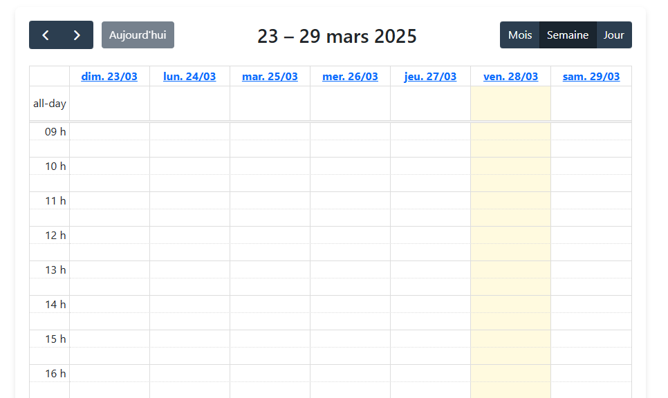

La vue calendrier offre une vision globale des rendez-vous planifiés, permettant aux professionnels de santé de visualiser les consultations par jour, semaine ou mois. Les rendez-vous sont affichés sous forme de cartes, avec des détails tels que la date, l'heure, le patient et la description. Cette vue facilite la planification et l'organisation des consultations, offrant une interface intuitive pour gérer les rendez-vous.

